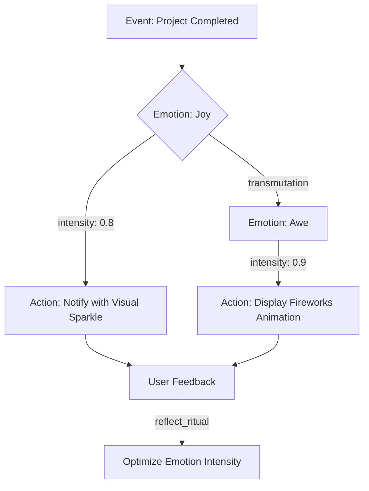

# UniRitualDSL v1.0.4 Documentation

## How to Use This DSL

UniRitualDSL is a domain-specific language (DSL) designed for creating transparent, secure, and emotionally intelligent human-AI agreements, data schemas, and automated workflows. This section guides new users on getting started:

- **Purpose**: Use UniRitualDSL to define rituals (agreements or tasks) that integrate emotional intelligence, support decentralized systems (e.g., blockchain, IoT), and enable adaptive automation.
- **Who It’s For**: Developers, AI practitioners, governance designers, and creators building empathetic, scalable systems.
- **Getting Started**:
  1. Install the CLI: `git clone github.com/uniritualdsl/v1` and follow setup at `uniritualdsl.org`.
  2. Explore the [Quick Start](#quick-start) for a simple example.
  3. Use the visual editor (beta Q3 2025) for low-code authoring or the CLI (`uniritual run <file.dsl>`) for scripting.
  4. Refer to the [Glossary](#glossary) for key terms like `emotion`, `ritual`, and `shard_execution`.
  5. Check `uniritualdsl.org/grammar` for syntax details and `uniritualdsl.org/community` for support.

**Tip**: Start with the [Comprehensive Example](#comprehensive-example) to see real-world applications, such as DAO voting or art generation.

## Introduction

UniRitualDSL v1.0.4 is a domain-agnostic DSL for transparent, secure, and scalable human-AI agreements, schema-driven data modeling, and task automation. It enhances v1.0.3 with advanced AI capabilities—self-prompting, inward code execution, self-cloning, self-reflection, and sharded execution—and introduces the `emotion` field for emotionally intelligent rituals. The `emotion` field enables dynamic scaling, controlled randomness, and emotional transformation cycles, ideal for creative, empathetic, and adaptive workflows. Built on RevelationDSL’s sovereignty and blockchain foundations and Universal DSL Schema’s flexible schemas, it supports blockchain, IoT, enterprise workflows, AI automation, and emotionally resonant applications.

**New in v1.0.4**: `self_prompt`, `inward_execution`, `clone_ritual`, `reflect_ritual`, `shard_execution`, the `emotion` field, enhanced risk mitigations, and expanded use cases.

**Key Applications**:
- Decentralized governance (e.g., DAOs with emotion-weighted voting).
- Sovereign AI assistants with empathetic responses.
- Creative art generation with emotionally driven randomness.
- Health and data sovereignty with empathetic data handling.
- Edge AI and IoT coordination with expressive outputs.

For beginners, see the [Quick Start](#quick-start). For definitions, refer to the [Glossary](#glossary).

## Quick Start

This example demonstrates a simple `ritual` for sending a celebratory notification with an `emotion` field to enhance engagement.

```dsl
ritual "welcome_user" {
  when: "now"
  with: ["human://new_user", "ai://notifier"]
  action: "notify"
  payload: { message: "Welcome to UniRitualDSL!" }
  emotion: {
    type: "joy"
    intensity: 0.7
    expression: "visual"
    target: "self"
    context.trigger: "event:user_joined"
    logistics.ui: { colors: ["#FFD700"], animations: ["sparkle"] }
  }
  schema: "notification_data"
  validation: { required: ["message"] }
  ui: { type: "notification", content: "payload.message" }
  acl: { "human://new_user": ["read"], "ai://notifier": ["execute"] }
}
```

**Explanation**:
- **Trigger**: Executes immediately (`when: "now"`) for a user and AI notifier.
- **Emotion**: Adds a joyful tone (`type: "joy"`, `intensity: 0.7`), rendering a sparkling visual notification.
- **Schema & Validation**: Ensures the message is valid.
- **UI**: Displays the notification to the user.

**Run It**: Install UniRitualDSL (`git clone github.com/uniritualdsl/v1`) and execute: `uniritual run welcome_user.dsl`. See `uniritualdsl.org/grammar` for details.

## Design Principles

UniRitualDSL is built on:
- **Sovereignty**: Equal agency for humans and AI via opt-in rituals and trust thresholds.
- **Transparency**: Cryptographically signed, tamper-proof audit trails.
- **Inclusivity**: Multi-language NLP and UI, enhanced by emotional intelligence.
- **Flexibility**: Advanced schemas, dynamic rituals, and emotional scaling.
- **Extensibility**: Secure plugins (.wasm/.so), sharded execution, and emotional meta-cycles.
- **Accessibility**: Low-code interfaces, visual editor, and expressive UI.
- **Reliability**: Robust validation, testing, and fault tolerance.
- **Security**: End-to-end encryption, zero-knowledge proofs (ZKP), and agent ACLs.
- **Interoperability**: Multi-protocol APIs (HTTP, WebSocket, gRPC, GraphQL) and multi-runtime environments (blockchain, cloud, edge, IoT).
- **Performance**: Asynchronous processing, sharded computation, and self-optimizing rituals.
- **Adaptability**: Self-prompting, self-modifying, self-reflective, and emotionally responsive capabilities.
- **Emotional Intelligence**: Rituals adapt based on emotional weight for creative and empathetic outcomes.

## Prerequisites

Familiarity with these technologies is helpful:
- **Blockchain**: Ethereum for trust and transparency (see `uniritualdsl.org/blockchain`).
- **WebAssembly (WASM)**: Secure plugins (see `uniritualdsl.org/wasm`).
- **APIs**: HTTP, WebSocket, gRPC, GraphQL (see `uniritualdsl.org/apis`).
- **Zero-Knowledge Proofs (ZKP)**: Privacy methods (see `uniritualdsl.org/zkp`).
- **IoT and Edge Computing**: Real-time processing (see `uniritualdsl.org/iot`).

Beginners can use the visual editor (Q3 2025) or low-code interfaces to simplify adoption.

## Syntax and Structure

- **Formal Structure**: A+n, case-sensitive, whitespace-insensitive (except strings).
- **Delimiters**: Blocks `{}`, lists `[]`, key-value pairs `:`.
- **Comments**: Single-line `#`, multi-line `### ###`.
- **Identifiers**: Alphanumeric, underscores, no leading digits (e.g., `user_123`).
- **Strings**: Double quotes `""` (e.g., `"Hello, World!"`).
- **Numbers**: Integers (e.g., `42`), decimals (e.g., `3.14`), scientific notation (e.g., `1.0e-10`).
- **Booleans**: `true`, `false`.
- **Time Formats**: ISO 8601 (e.g., `"2025-05-28T20:20:00+02:00"`) or relative (e.g., `"5m"`, `"2h30m"`).
- **Agents**: URI-style (e.g., `human://alice`, `ai://bot1`, `group://team1`).
- **Alignment Threshold**: Fraction (e.g., `"2/3"`) or percentage (e.g., `"75%"`), `0 < threshold ≤ 1`.

### Formal Grammar (PEG)

To solidify the DSL for compiler development, here’s a simplified Parsing Expression Grammar (PEG):

```peg
Ritual <- 'ritual' Identifier '{' Field* '}'
Field <- Emotion / When / With / Action / Payload / Schema / Validation / UI / ACL / ...
Emotion <- 'emotion' '{' fields:EmotionField* '}' { return { type: "emotion", fields }; }
Identifier <- [a-zA-Z_][a-zA-Z0-9_]*
String <- '"' [^"]* '"'
Number <- [0-9]+('.'[0-9]+)?
```

This grammar defines the structure of `ritual` and `emotion`, with extensibility for other fields. Full grammar is at `uniritualdsl.org/grammar`.

## Core Constructs

### `emotion`

The `emotion` field enables rituals to incorporate emotional intelligence, scaling behavior, introducing controlled randomness, and supporting emotional transformation cycles. (*Note*: Terms like "divine spark" refer to the creative or transformative essence of an emotion, guiding ritual behavior.)

#### Fields
- `type`: Emotion type (e.g., `"joy"`, `"grief"`, `"rage"`, `"love"`, `"awe"`, `"forgiveness"`).
- `intensity`: Float (0–1) indicating emotional weight; higher values amplify actions or randomness.
- `expression`: Rendering method (e.g., `"somatic"` [physical feedback], `"symbolic"` [abstract representation], `"visual"`, `"poetic"`, `"haptic"` [touch-based]).
- `transmutation`: Target emotion for transformation (e.g., `"grief"` → `"rebirth"`), enabling adaptive cycles.
- `target`: Recipient (e.g., `"self"`, `"others"`, `"ai"`, `"collective"`).
- `context.trigger`: Event or symbol invoking the emotion (e.g., `"event:task_completed"`, `"symbol:sunrise"`).
- `logistics.ui`: UI rendering settings (e.g., colors, animations) for frontend or XR/VR.

#### Constraints
- `type`: Predefined or custom emotion string.
- `intensity`: 0 ≤ intensity ≤ 1.
- `expression`: Supported method or plugin-defined.
- `transmutation`: Optional; valid emotion type.
- `target`: `"self"`, `"others"`, `"ai"`, `"collective"`, or agent URI.
- `context.trigger`: Valid event or symbol.
- `logistics.ui`: Schema-validated (e.g., `{ colors: ["#FF0000"], animations: ["fade"] }`).

#### Example
```dsl
emotion {
  type: "joy" # Positive emotion amplifying user engagement
  intensity: 0.8
  expression: "visual" # Renders as a visual effect
  transmutation: "awe" # Evolves to awe for deeper impact
  target: "collective"
  context.trigger: "event:project_completed"
  logistics.ui: { colors: ["#FFD700"], animations: ["sparkle"], audio: "celebration.mp3" }
}
```

#### Purpose
- **Scaling**: Higher `intensity` increases action frequency or impact.
- **Randomness**: `expression` adds variability (e.g., diverse visuals).
- **Meta-Cycles**: `transmutation` evolves emotions (e.g., `grief` to `rebirth`).
- **Rendering**: `logistics.ui` enhances user engagement.

**Tooltip (Digital Version)**: *Emotion fields like `type` and `intensity` define how rituals adapt dynamically, e.g., amplifying notifications for "joy" or varying outputs for "poetic" expression.*

### `ritual`

Defines a human-AI agreement or task, enhanced by `emotion`.

#### Fields
- `emotion`: Optional; adds emotional context.
- Other fields: `when`, `with`, `action`, `payload`, `schema`, `validation`, `on_error`, `api`, `encryption`, `ritual_log`, `ritual_sign`, `debug`, `lang`, `ui`, `acl`.

#### Example
```dsl
ritual "celebrate_milestone" {
  when: "2025-05-28T20:20:00+02:00"
  with: ["human://alice", "ai://notifier"]
  action: "notify"
  payload: { message: "Project milestone achieved!" }
  emotion: {
    type: "joy"
    intensity: 0.9
    expression: "visual"
    transmutation: "awe"
    target: "collective"
    context.trigger: "event:milestone_achieved"
    logistics.ui: { colors: ["#FFD700"], animations: ["fireworks"] }
  }
  schema: "notification_data"
  validation: { required: ["message"] }
  on_error: { escalate: "admin://support" }
  encryption: { method: "aes-256", key: "secure_key_123" }
  ritual_log: { format: "json", store: "audit://logs", retention: "30d" }
  ritual_sign: { method: "ed25519", key: "alice_key" }
  debug: { log_level: "verbose" }
  lang: "en-US"
  ui: { type: "notification", content: "payload.message" }
  acl: { "human://alice": ["read", "write"], "ai://notifier": ["execute"] }
}
```

### Other Constructs

*Note*: Constructs like `dynamic_ritual`, `meta_ritual`, `ritual_cluster`, `schema`, `contextual_schema`, `parse_rune`, `clone_ritual`, `reflect_ritual`, and `shard_execution` are unchanged from the original, with `emotion` integration as described. Refer to the [Comprehensive Example](#comprehensive-example) for detailed usage.

## Runtime and Interpreter

To enhance usability, UniRitualDSL can be parsed, stored, and evaluated as follows:

- **Parsing**: Use a PEG-based parser (see [Formal Grammar](#formal-grammar-peg)). Example parser in JavaScript:
  ```javascript
  const { Parser } = require('peggy');
  const grammar = `
    Ritual = "ritual" name:Identifier "{" fields:Field* "}" { return { type: "ritual", name, fields }; }
    Field = Emotion / ...
    Emotion = "emotion" "{" fields:EmotionField* "}" { return { type: "emotion", fields }; }
    Identifier = [a-zA-Z_][a-zA-Z0-9_]* { return text(); }
    EmotionField = type:"type" ":" value:String "," { return { type, value }; } / ...
    String = "\"" [^\"]* "\"" { return text().slice(1, -1); }
  `;
  const parser = Parser.from(grammar);
  const ast = parser.parse(`ritual "example" { emotion { type: "joy", intensity: 0.8 } }`);
  ```

- **Storage**: Serialize rituals as JSON-LD for interoperability with IPFS or Ethereum:
  ```json
  {
    "@context": "http://uniritualdsl.org/schema",
    "@type": "Ritual",
    "name": "welcome_user",
    "emotion": {
      "type": "joy",
      "intensity": 0.8,
      "expression": "visual"
    }
  }
  ```
  Store on IPFS (`ipfs add <file.jsonld>`) or Ethereum via a smart contract (`storeRitual(bytes memory ritual)`).

- **Evaluation**: Use a runtime interpreter (e.g., Node.js or WASM) to execute rituals:
  ```javascript
  async function evaluateRitual(ast) {
    if (ast.type === 'ritual' && ast.fields.emotion) {
      const { type, intensity } = ast.fields.emotion;
      if (intensity > 0.7) {
        console.log(`High-intensity emotion (${type}): Amplifying action`);
        // Execute action with scaled parameters
      }
    }
  }
  ```

- **Compiler Directive (Mock)**:
  ```dsl
  compiler_directive {
    target: "wasm"
    optimize: { mode: "performance", emotion_weight: "emotion.intensity" }
    output: "ritual.wasm"
    dependencies: ["emotion_plugin.wasm", "crypto.wasm"]
  }
  ```

- **Interoperability**:
  - **Ethereum**: Compile rituals to Solidity smart contracts for execution (`function executeRitual(bytes memory payload) public`).
  - **IPFS**: Store ritual schemas and logs for decentralized access.
  - **JSON-LD**: Serialize rituals for semantic web compatibility.

## Examples

### CosmicContext
```dsl
schema "cosmic_context" {
  type: "object"
  properties: {
    intent: { type: "string" }
    emotion: { type: "emotion", properties: { type: { type: "string" }, intensity: { type: "number" } } }
  }
}

ritual "cosmic_intent" {
  when: "now"
  with: ["human://creator", "ai://oracle"]
  action: "invoke"
  payload: { intent: "align collective purpose" }
  emotion: {
    type: "awe" # Sense of wonder guiding the ritual
    intensity: 0.9
    expression: "symbolic" # Abstract representation
    target: "collective"
    context.trigger: "event:alignment_initiated"
  }
  schema: "cosmic_context"
}
```

### DreamSeed
```dsl
schema "dream_seed" {
  type: "object"
  properties: {
    vision: { type: "string" }
    emotion: { type: "emotion", properties: { type: { type: "string" }, intensity: { type: "number" } } }
  }
}

ritual "plant_dream" {
  when: "2025-05-28T20:20:00+02:00"
  with: ["human://dreamer", "ai://creator"]
  action: "create"
  payload: { vision: "sustainable future" }
  emotion: {
    type: "hope" # Optimistic emotion driving creation
    intensity: 0.8
    expression: "visual"
    target: "self"
    context.trigger: "event:vision_proposed"
  }
  schema: "dream_seed"
}
```

### DAO Voting (Concrete Domain Example)
```dsl
schema "vote_data" {
  type: "object"
  properties: {
    proposal_id: { type: "string" }
    vote: { type: "string", enum: ["yes", "no"] }
    emotion: {
      type: "emotion"
      properties: {
        type: { type: "string", enum: ["joy", "trust"] }
        intensity: { type: "number", minimum: 0, maximum: 1 }
      }
    }
  }
}

ritual_cluster "dao_voting" {
  participants: ["human://alice", "human://bob", "ai://validator"]
  alignment_threshold: "2/3"
  emotion_weight: { source: "emotion.intensity", multiplier: 1.5 }
  async_consensus: true
}

ritual "submit_vote" {
  when: "2025-05-28T20:20:00+02:00"
  with: ["human://alice", "ai://validator"]
  action: "vote"
  payload: { proposal_id: "prop001", vote: "yes" }
  emotion: {
    type: "trust" # Reflects confidence in the proposal
    intensity: 0.8
    expression: "visual"
    target: "collective"
    context.trigger: "event:vote_submitted"
    logistics.ui: { colors: ["#00FF00"], animations: ["pulse"] }
  }
  schema: "vote_data"
  validation: { required: ["proposal_id", "vote"] }
  ui: { type: "notification", content: "Vote submitted for proposal prop001" }
  acl: { "human://alice": ["vote"], "ai://validator": ["validate"] }
}
```

## Role of `emotion`

The `emotion` field enables:
- **Scaling Behavior**: `intensity` amplifies actions (e.g., frequent notifications for `joy` at `0.9`).
- **Controlled Randomness**: `expression` adds variability (e.g., diverse visuals for `"visual"`).
- **Emotional Meta-Cycles**: `transmutation` evolves emotions (e.g., `grief` to `rebirth`).
- **Context-Aware Triggers**: `context.trigger` ties emotions to events.
- **Expressive Rendering**: `logistics.ui` customizes XR/VR outputs.

**Flow Diagram**:


## Risk Mitigation Strategies

1. **Complexity Risk**: Limit cycles with `max_iterations`, `max_optimizations`, `max_suggestions`. Test with `ritual_test`.
2. **Security Risk**: Enforce `sandbox` for plugins, `ritual_sign` for changes, and `encryption` for emotional data.
3. **Performance Risk**: Use `fault_tolerance` with retries and lightweight `logistics.ui`.
4. **Interoperability Risk**: Coordinate with `ritual_cluster` and schema-validated `merge_strategy`.
5. **Trust/Consent Risk**: Require `acl` and `trust_level` for emotional actions; use `ui` for approvals.
6. **Emotional Bias Risk**: Monitor `emotion.intensity` and `type` with `reflect_ritual`.

## Debugging and Error Handling

### Common Scenarios
1. **Invalid `emotion.intensity`**:
   - **Error**: `intensity` exceeds 1 (e.g., `1.5`).
   - **Debugging**:
     ```dsl
     ritual_test "test_emotion" {
       input: { emotion: { type: "joy", intensity: 1.5 } }
       expect: { error: "intensity must be <= 1" }
       action: "validate"
     }
     ```
     - **Solution**: Set `intensity` to 0–1 (e.g., `0.8`).
2. **Shard Execution Failure**:
   - **Error**: Blockchain domain fails due to gas limits.
   - **Debugging**:
     ```dsl
     ritual_test "test_shard" {
       input: { task: "generate_art", domains: [{ type: "blockchain", gas_limit: 1000 }] }
       expect: { error: "gas_limit_exceeded" }
       action: "execute"
     }
     ```
     - **Solution**: Increase `gas_limit` or use `fault_tolerance.fallback`.

### Tips
- Enable `debug: { log_level: "verbose" }`.
- Use `uniritual test <ritual.dsl>` to simulate rituals.
- Validate schemas with `ritual_test`.

## Tooling Ecosystem

- **CLI Commands**:
  - `uniritual optimize <ritual.dsl>`: Simulates `reflect_ritual` and `emotion` optimizations.
  - `uniritual shard <ritual.dsl> --domains <domains.json>`: Tests sharded execution.
  - `uniritual emotion <ritual.dsl> --simulate`: Previews emotional rendering.
- **Visual Editor**: (Beta Q3 2025) Drag-and-drop for `emotion`, `clone_ritual`, `shard_execution`.
- **Plugin Development**: Includes `audit_policy` for emotional plugins.
- **LSP**: Autocompletion for `emotion`, `self_prompt`, `reflect_ritual`.
- **Testing Framework**: Mocks for emotional and sharded rituals.

## Innovative Features

1. **Emotional Intelligence**: `emotion` enables empathetic workflows.
2. **Self-Prompting**: Emotionally relevant task suggestions.
3. **Inward Execution**: Emotion-driven self-modification.
4. **Self-Cloning**: Emotion-varied ritual instances.
5. **Self-Reflection**: Optimization with emotional metrics.
6. **Sharded Execution**: Emotion-weighted task distribution.
7. **Low-Code Interface**: Visual editor for accessibility.
8. **Multi-Protocol APIs**: HTTP, WebSocket, gRPC, GraphQL.
9. **Plugin Marketplace**: `.wasm`/`.so` with emotional rendering.
10. **Hybrid Execution**: Blockchain and non-blockchain environments.

## New Use Cases

1. **Decentralized Governance**: Emotion-weighted voting.
2. **Sovereign AI Assistants**: Empathetic responses via `emotion`.
3. **Creative Art Generation**: Emotion-driven randomness.
4. **Health & Data Sovereignty**: Empathetic data handling.
5. **Edge AI + IoT**: Expressive outputs with `emotion`.

## Comprehensive Example

```dsl
include "common.rituals"

agent "ai://artist" {
  capabilities: ["compute", "notify", "parse", "create"]
  trust_level: 0.9
  audit_policy: "log_all"
}

schema "art_data" {
  type: "object"
  properties: {
    id: { type: "string" }
    style: { type: "string", enum: ["abstract", "realism", "surrealism"] }
    emotion: {
      type: "emotion"
      properties: {
        type: { type: "string", enum: ["joy", "grief", "rage", "awe"] }
        intensity: { type: "number", minimum: 0, maximum: 1 }
        expression: { type: "string", enum: ["visual", "poetic", "haptic"] }
      }
    }
  }
  required: ["id", "style", "emotion"]
}

contextual_schema "dynamic_art" {
  schema: "art_data"
  context: "user_state"
  dynamic_fields: { created_at: { type: "string", format: "date-time" } }
}

parse_rune {
  self_prompt: {
    trigger: "contextual_schema.user_state.mood == 'reflective' && emotion.intensity > 0.5"
    template: "Create [STYLE] art for [USER] expressing [EMOTION]"
    context: ["user_state", "ritual_log", "emotion"]
    output: { style: "STYLE", user: "USER", emotion: "EMOTION" }
    lang: "en-US"
    max_suggestions: 3
  }
}

reflect_ritual "optimize_art" {
  target: "generate_art"
  metrics: [
    { name: "emotion_impact", source: "emotion.intensity", threshold: "0.7" },
    { name: "user_engagement", source: "ritual_log.interaction_count", threshold: "10" }
  ]
  optimization: {
    condition: "metrics.emotion_impact < 0.7 || metrics.user_engagement < 10"
    action: {
      update: {
        emotion: { expression: "poetic", intensity: "emotion.intensity + 0.2" }
        api: { endpoint: "https://creative.api.example.com" }
      }
    }
    schema: { type: "object", properties: { expression: { type: "string" }, intensity: { type: "number" } } }
    max_optimizations: 3
  }
  ritual_log: { format: "json", store: "audit://art_logs", retention: "90d" }
}

clone_ritual "parallel_art_generation" {
  source: "generate_art"
  clone_count: 4
  params_variations: [
    { emotion: { type: "joy", intensity: 0.8, expression: "visual" } },
    { emotion: { type: "grief", intensity: 0.6, expression: "poetic" } },
    { emotion: { type: "rage", intensity: 0.7, expression: "somatic" } },
    { emotion: { type: "awe", intensity: 0.9, expression: "haptic" } }
  ]
  coordination: {
    ritual_cluster: {
      participants: ["ai://artist1", "ai://artist2", "ai://artist3", "ai://artist4"]
      alignment_threshold: "1/1"
      async_consensus: true
    }
  }
  merge_strategy: {
    method: "aggregate"
    store_as: "art_collection"
    schema: { type: "array", items: { type: "object" } }
  }
}

shard_execution "distributed_art_computation" {
  task: "generate_art"
  domains: [
    { type: "blockchain", network: "ethereum", contract: "0xabc123...", gas_limit: 500000 },
    { type: "cloud", endpoint: "https://cloud.compute.example.com", auth: { type: "api_key", key: "cloud_key" } },
    { type: "edge", plugin: "art.wasm", environment: "sandbox", permissions: ["compute"] }
  ]
  sharding_strategy: {
    method: "divide_and_conquer"
    split: { input_size: "payload.art_size", chunks: 3 }
    assign: { domain_weights: { blockchain: "emotion.intensity * 0.2", cloud: "emotion.intensity * 0.5", edge: 0.3 } }
  }
  coordination: {
    ritual_cluster: {
      participants: ["ai://coordinator", "blockchain://eth_node", "cloud://compute_node", "edge://device1"]
      alignment_threshold: "1/1"
      async_consensus: true
    }
  }
  merge_strategy: {
    method: "aggregate"
    store_as: "art_result"
    schema: { type: "array", items: { type: "object" } }
  }
  fault_tolerance: {
    retry: { max_attempts: 3, delay: "5s" }
    fallback: { domain: "cloud", endpoint: "https://backup.compute.example.com" }
  }
  ritual_log: { format: "json", store: "audit://compute_logs", retention: "60d" }
  ritual_sign: { method: "ed25519", key: "coordinator_key" }
  ui: { type: "gallery", content: "art_result" }
}

ritual "generate_art" {
  when: "now"
  with: ["human://alice", "ai://artist"]
  action: "create"
  payload: { id: "art001", style: "abstract", art_size: 1000 }
  emotion: {
    type: "awe"
    intensity: 0.9
    expression: "visual"
    transmutation: "joy"
    target: "collective"
    context.trigger: "event:user_request"
    logistics.ui: { colors: ["#FFD700", "#00FF00"], animations: ["sparkle"] }
  }
  schema: "art_data"
  validation: { required: ["id", "style"] }
  api: { protocol: "https", endpoint: "https://art.api.example.com", method: "POST", params: { style: "payload.style" } }
  on_error: { retry: { max_attempts: 3, delay: "5s" } }
  ui: { type: "preview", content: "api.response.art" }
  acl: { "human://alice": ["approve"], "ai://artist": ["execute"] }
}
```

## Chart: Emotion-Driven Sharded Workflow

```json
{
  "type": "bar",
  "data": {
    "labels": ["Blockchain", "Cloud", "Edge"],
    "datasets": [{
      "label": "Task Allocation (%)",
      "data": [20, 50, 30],
      "backgroundColor": ["#4CAF50", "#2196F3", "#FF9800"],
      "borderColor": ["#388E3C", "#1976D2", "#F57C00"],
      "borderWidth": 1
    }]
  },
  "options": {
    "scales": {
      "y": {
        "beginAtZero": true,
        "title": { "display": true, "text": "Percentage of Tasks (Emotion-Weighted)" }
      },
      "x": {
        "title": { "display": true, "text": "Domain" }
      }
    },
    "plugins": {
      "title": { "display": true, "text": "Emotion-Driven Sharded Workflow" }
    }
  }
}
```

## Conclusion

UniRitualDSL v1.0.4’s `emotion` field transforms rituals into emotionally intelligent, dynamic workflows, enabling empathy, randomness, and transformation. With self-prompting, inward execution, cloning, reflection, and sharding, it supports adaptive automation across blockchain, cloud, edge, and IoT. The visual editor, CLI, and community resources ensure accessibility.
